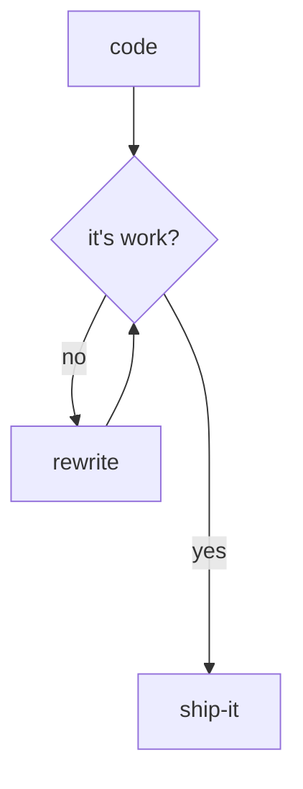

    

 

    <b>Hi &#128075;</b>
     
    <i>I'm a student of life, learning gives me more dopamine.</i>

    

    

    
breakdown, prioritize, organize, single thread || brainstorm, connect the dot, abstract, multi thread

    

    

        main interest: awesome-wm (lua) | rofi-launcher | neovim-telescope | wezterm | zsh (spaceship) | tmux | fzf | atuin
    

  

INTEREST

 

  
📚 Workflow & Tools  
📚 Awesome Repo & LeetCode  
📚 Best Practices & Architecture  
📚 Algorithm & Data Structure  
📚 Clean Code & Style Guide  
📚 Test Driven & Functional Programming  
📚 Design Patterns & Case Study  
📚 DDD NodeJS & DDD ReactJS  
       📚 Roadmap & Standards  

  

Profile

 

## Code

- [twitter](http://www.twitter.com/gema_naranyala)
- [dev](https://dev.to/fudzermifthakul)
- [medium](https://medium.com/@fudzer.m.huda)
- [stackoverflow](https://stackoverflow.com/users/8528576/fudzer-m-huda)

## Design

- [dribbble](https://dribbble.com/naranyala)
- [behance](https://www.behance.net/fudzermifthak)
- [codepen](https://codepen.io/naranyala)

  

Stack

 

- [awesome-shell](https://github.com/alebcay/awesome-shell)
- [the-art-of-command-line](https://github.com/jlevy/the-art-of-command-line)
- [awesome-bash](https://github.com/awesome-lists/awesome-bash)
- [pure-bash-bible](https://github.com/dylanaraps/pure-bash-bible)
- [modern-unix](https://github.com/ibraheemdev/modern-unix)
- [awesome-cheatsheets](https://github.com/LeCoupa/awesome-cheatsheets)
- [awesome-linux-software](https://github.com/luong-komorebi/Awesome-Linux-Software)

    
## Today Learning

    
    
    
    
    
    
    
    

    
## Future Interest

    
    
    
    
    
    
    
    

  

 

 

     

  

    
    
    

<!--

    
|  X  |  Y  |  Z  |
| --- | --- | --- |
|  01011000  |  01011001  |  01011010  |
    

-->
